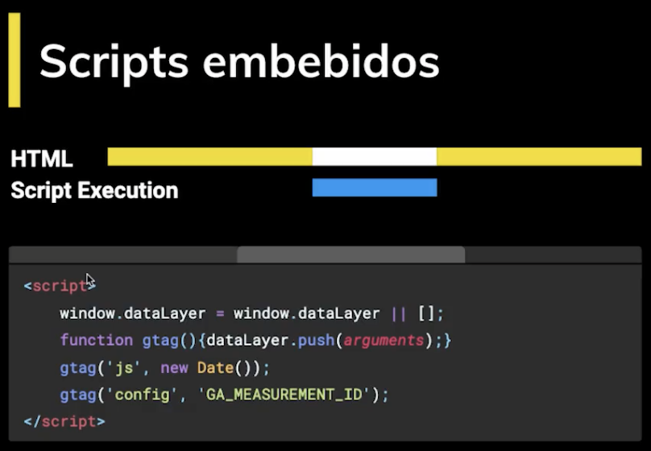
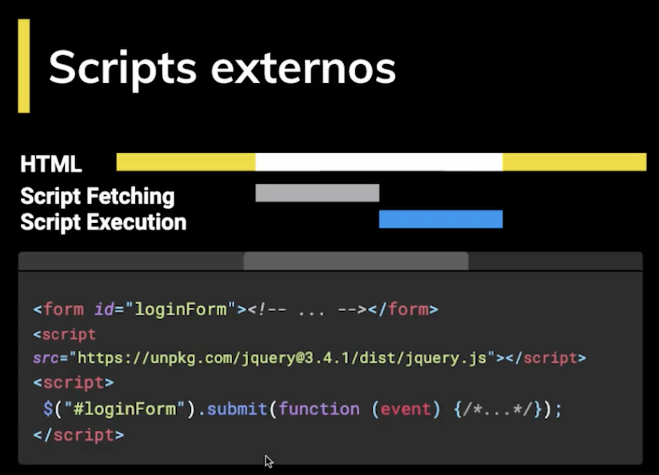
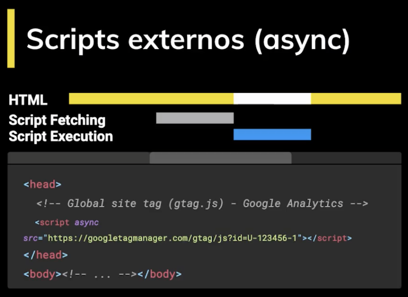
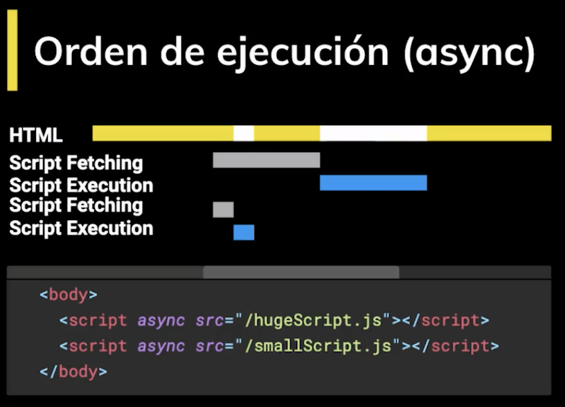
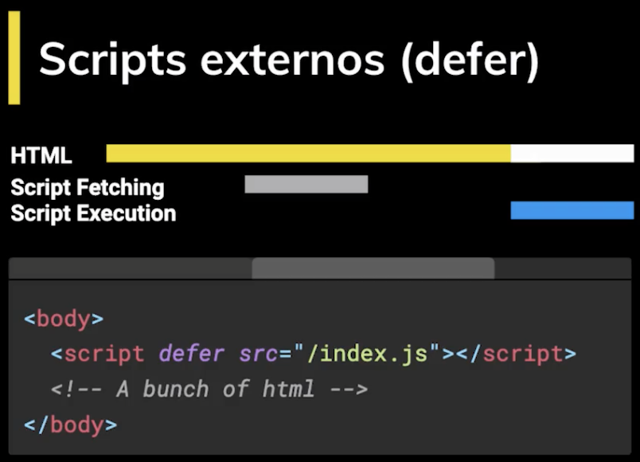
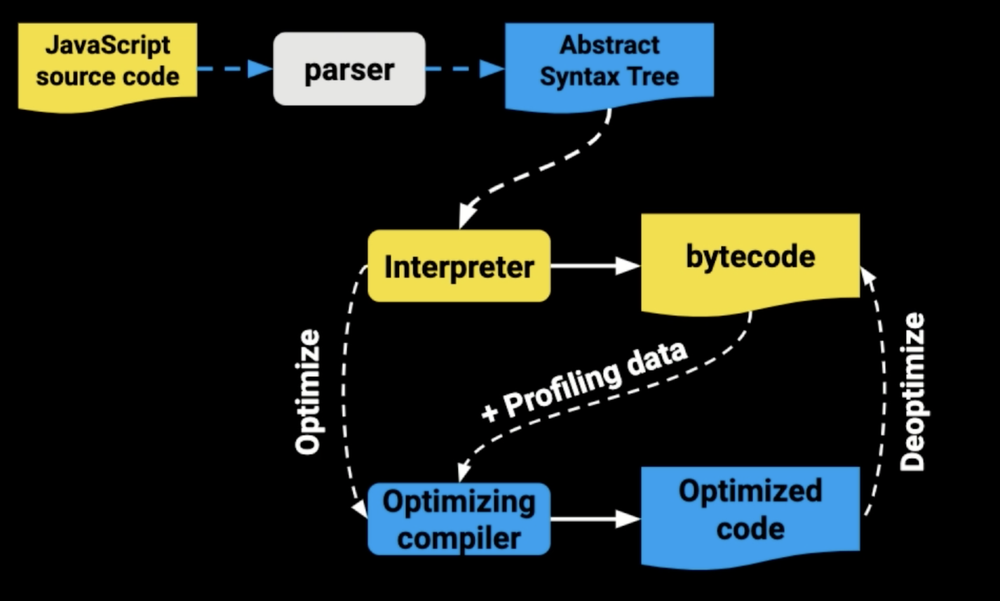
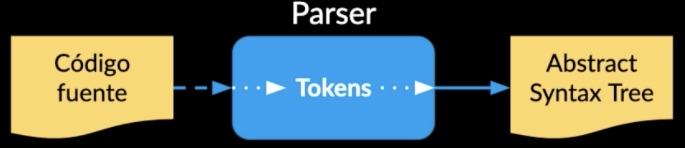
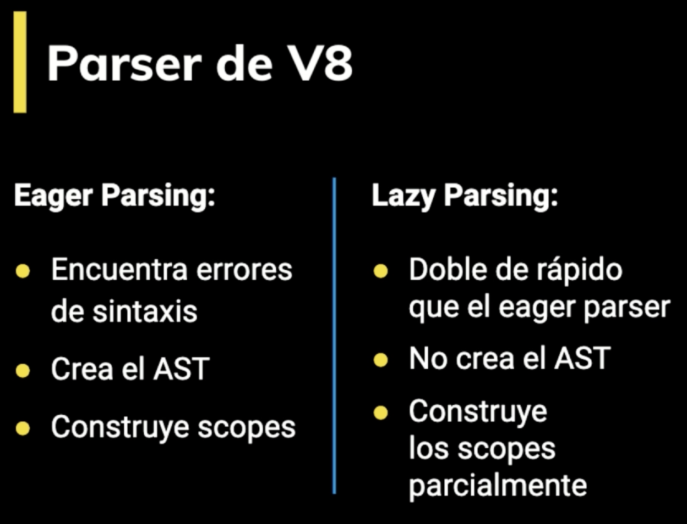
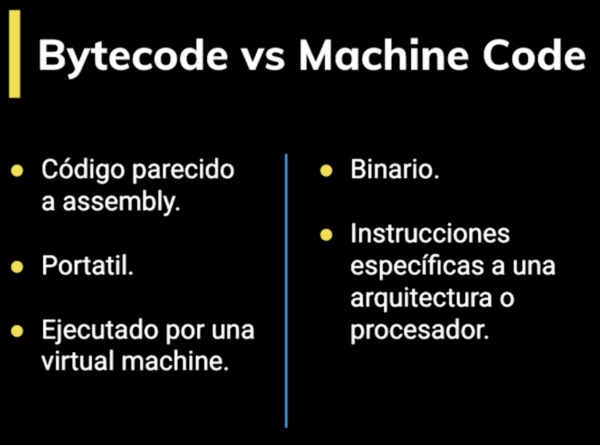
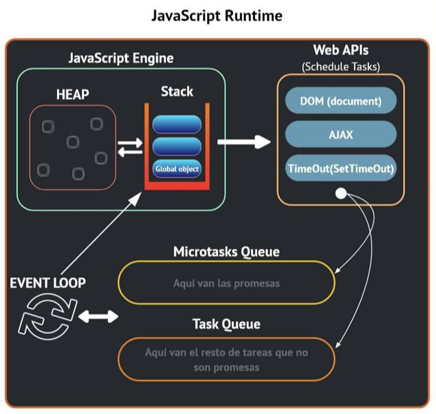

# jsPro

## 1. Repaso de Conceptos Fundamentales

#### Cómo llega un script al navegador
El **DOM** es la representación que hace el navegador de un documento HTML.

El navegador interpreta el archivo HTML y cuando termina de transformarlo al DOM se dispara el evento **DOMContentLoaded** lo que significa que todo el documento está disponible para ser manipulado.

Todo script que carguemos en nuestra página tiene un llamado y una ejecución.

##### Formas de poner código JS en el documento HTML

1. Scripts embebidos

2. Scripts externos Sincronos

3. Scripts externos Asincronos
Tanto con async como defer podemos hacer llamados asíncronos pero tiene sus diferencias:
    - **async:** Con async podemos hacer la petición de forma asíncrona y no vamos a detener la carga del DOM hasta que se haga la ejecución del código.
    
    
    - **defer:** La petición es igual asíncrona como en el async pero va a deferir la ejecución del Javascript hasta el final de que se cargue todo el documento.
Hay que tener en cuenta que cuando carga una página y se encuentra un script a ejecutar toda la carga se detiene. Por eso se recomienda agregar tus scripts justo antes de cerrar el body para que todo el documento esté disponible.

#### Scope
- **¿Qué es el Scope?**
El Scope es el alcanse que tienen las variables en donde están disponibles.
El Scope o ámbito es lo que define el tiempo de vida de una variable, en que partes de nuestro código pueden ser usadas.

- **Global Scope**
Variables disponibles de forma global se usa la palabra var, son accesibles por todos los scripts que se cargan en la página y se declaran fuera de una función o bloque. Aquí hay mucho riesgo de sobreescritura.

- **Function Scope**
Variables declaradas dentro de una función utilizando var sólo visibles dentro de ella misma (incluyendo los argumentos que se pasan a la función).

- **Block Scope**
Variables definidas dentro de un bloque, por ejemplo variables declaradas dentro un loop while o for. Se usa let y const para declarar este tipo de variables.

- **Module Scope**
Cuando se denota un script de tipo module con el atributo type="module las variables son limitadas al archivo en el que están declaradas.

Partiendo del módelo Cliente-Servidos de la web, JavaScript trabaja con ambitos globales en cada lado:
- En el lado del **Cliente(Frontend)**, el ambito global se trabaja con la palabra reservada **window**
- En el lado del **Servidos(Backend)**, el ambito global se trabaja con la palabra reservada **...**

#### Clousure / Clausuras
**¿Qué son las Clousures?**
- Son el resultado de la combinación del Scope con funciones.
- Son funciones que regresan una función o un objeto con funciones que mantienen las variables que fueron declaradas fuera de su scope.
- Es una funcion que retorna otra funcion, ademas recuerda el scope en el que fueron creadas
- Los closures nos sirven para tener algo parecido a variables privadas, característica que no tiene JavaScript por default. Es decir encapsulan variables que no pueden ser modificadas directamente por otros objetos, sólo por funciones pertenecientes al mismo.

#### This
_**this**_ se refiere a un objeto, ese objeto es el que actualmente está ejecutando un pedazo de código.

No se puede asignar un valor a this directamente y este depende de en que scope nos encontramos:
- Cuando llamamos a _this_ en el **Global Scope o Function Scope**, se hace referencia al objeto window. A excepción de cuando estamos en **strict mode** que nos regresará undefined.
- Cuando llamamos a _this_ desde **una función** que está contenida en un objeto, _this_ se hace referencia a ese objeto.
- Cuando llamamos a _this_ desde una **clase**, se hace referencia a la instancia generada por el constructor.

#### Los métodos call, apply y bind

El objeto this no lo podemos asignar directamente, pero si podemos asignar propiedades de dicho objeto, pero existen tres métodos que nos permites afectar directamente el objeto this.

Estas funciones nos sirven para establecer el valor de this, es decir cambiar el contexto que se va usar cuando la función sea llamada.

Las funciones **call, apply y bind** son parte del **prototipo Function**. Toda función usa este prototipo y por lo tanto tiene estas tres funciones.

- **functionName.call():** Ejecuta la función recibiendo como primer argumento el _**objeto this**_ y los siguientes son los argumentos que recibe la función que llamó a call.
- **functionName.apply():** Apply hace la misma funcionalidad que Call(), la diferencia está en la manera de pasarle los argumentos.
- **functionName.bind():** Recibe como primer y único argumento el this. No ejecuta la función, sólo regresa otra (nueva) función con el nuevo this integrado.
- **tip:** La C de Call -> Comma, La A de Apply -> Array. Así se pasan los argumentos en cada uno.

#### Prototype

En Javascript todo son objetos, no tenemos clases, no tenemos ese plano para crear objetos.

Todos los objetos “heredan” de un prototipo que a su vez hereda de otro prototipo y así sucesivamente creando lo que se llama la _**prototype chain**_.

La keyword _**new**_ crea un nuevo objeto que “hereda” todas las propiedades del prototype de otro objeto. No confundir prototype con proto que es sólo una propiedad en cada instancía que apunta al prototipo del que hereda.

#### Herencia prototipal

Por default los objetos en JavaScript tienen cómo prototipo a **Object** que es el punto de partida de todos los objetos, es el prototipo padre. Object es la raíz de todo, por lo tanto tiene un prototipo padre undefined.

Cuando se llama a una función o variable que no se encuentra en el mismo objeto que la llamó, se busca en toda la prototype chain hasta encontrarla o regresar undefined.

La función **hasOwnProperty** sirve para verificar si una propiedad es parte del objeto o si viene heredada desde su prototype chain.

_**nameObject.prototype**_ es un objeto donde definimos el prototipo de las instancias de _**nameObject.**_ Es decir las instancias de _**nameObject**_ van a heredar de _**nameObject.prototype.**_

## 2. Cómo funciona JavaScript

[Parser bajo el capó](https://esprima.org/demo/parse.html)

El JS Engine recibe el código fuente y lo procesa de la siguiente manera:
1. Recibe código fuente
2. El parser descompone y crea tokens que integran al **Abstract Syntax tree (AST).**
3. Se compila a bytecode y se ejecuta.
4. Lo que se pueda se optimiza a machine code y se reemplaza el código base.

### ¿Qué hace un Parser?
Un parser recibe el código fuente ( el código que escribirmos) y lo analiza para fragmentarlo en partes llamadas **Tokens**, con los cuales creará el **Abstract Syntax Tree - AST**

Un _**SyntaxError**_ es lanzado cuando el motor JavaScript encuentra partes que no forman parte de la sintaxis del lenguaje y esto lo logra gracias a que se tiene un AST generado por el parser.

El parser es del 15% al 20% del proceso de ejecución por lo que hay que usar parser del código justo en el momento que lo necesitamos y no antes de saber si se va a usar o no.

Hay dos manearas de hacer Parsing en V8

### ¿Qué es el Abstract Syntax Tree - AST?
[AST Explorer](https://astexplorer.net)

Es una estructura de datos qué representa un programa.
Se usa en:
- JavaScript Engine
- Bundlers: WebPack, Rollup, Parcel
- Transpilers: Babel
- Linters: ESLint, Prettify, Prettier
- Type checkers: TypeScript, Flow
- Syntax HightLight

### ¿Cómo funciona el JavaScript Engine?

Una vez tenemos el AST ahora hay que convertirlo a Bytecode.
Bytecode es como el código assembler pero en lugar de operar en el procesador opera en la máquina virtual V8 del navegador.
Machine code es el más bajo nivel, es código binario que va directo al procesador.
El profiler se sitúa en medio del bytecode y el optimizador
Cada máquina virtual tiene sus particularidades, por ejemplo V8 tiene algo llamado Hot Functions.
Cuando una sentencia función es ejecutada muy frecuentemente, V8 la denomina como una hot function y hace una optimización que consiste en convertirla a machine code para no tener que interpretarla de nuevo y agilizar su ejecución.

Cada navegador tiene su implementación de JavaScript Engine:
- SpiderMonkey - Firefox
- Chackra - Edge
- JavaScriptCore - Safari
- V8 - Chrome

### Event loop

- [Event loop](http://latentflip.com/loupe/?code=JC5vbignYnV0dG9uJywgJ2NsaWNrJywgZnVuY3Rpb24gb25DbGljaygpIHsKICAgIHNldFRpbWVvdXQoZnVuY3Rpb24gdGltZXIoKSB7CiAgICAgICAgY29uc29sZS5sb2coJ1lvdSBjbGlja2VkIHRoZSBidXR0b24hJyk7ICAgIAogICAgfSwgMjAwMCk7Cn0pOwoKY29uc29sZS5sb2coIkhpISIpOwoKc2V0VGltZW91dChmdW5jdGlvbiB0aW1lb3V0KCkgewogICAgY29uc29sZS5sb2coIkNsaWNrIHRoZSBidXR0b24hIik7Cn0sIDUwMDApOwoKY29uc29sZS5sb2coIldlbGNvbWUgdG8gbG91cGUuIik7!!!PGJ1dHRvbj5DbGljayBtZSE8L2J1dHRvbj4%3D)
- [JS RunTime Visualization](https://www.jsv9000.app)
- [JavaScript Visualized: Event Loop](https://dev.to/lydiahallie/javascript-visualized-event-loop-3dif)

El Event Loop hace que Javascript parezca ser multihilo a pesar de que corre en un solo proceso.

Javascript se organiza usando las siguientes estructuras de datos:
1. **Stack:** Va apilando de forma organizada las diferentes instrucciones que se llaman. Lleva así un rastro de dónde está el programa, en que punto de ejecución nos encontramos. Se comporta como una Pila, **Last In First Out - LIFO**
2. **Memory Heap:** De forma desorganizada se guarda información de las variables y del scope.
3. **Schedule Tasks:** Aquí se agregan a la cola, las tareas programadas para su ejecución.
4. **Task Queue:** Aquí se agregan las tares que ya están listas para pasar al stack y ser ejecutadas. El stack debe estar vacío para que esto suceda. Es una estrucutra de datos que se comporta como una fila, **First In Firts Out - FIFO**
5. **MicroTask Queue:** Aquí se agregan las promesas. Esta Queue es la que tiene mayor prioridad.
El Event Loop es un loop que está ejecutando todo el tiempo y pasa periódicamente revisando las queues y el stack moviendo tareas entre estas dos estructuras.

## 3. Fundamentos Intermedios

## Promesas

- [Await and Async Explained with Diagrams and Examples](https://nikgrozev.com/2017/10/01/async-await/)
- [Promesas](https://platzi.com/tutoriales/1642-javascript-profesional/12686-promesas-4/)
- [Leonidas + ejemplo](https://www.youtube.com/watch?v=dRIZNayrcLk)

Para crear las promesas usamos la clase Promise. El constructor de Promise recibe un sólo argumento, un callback con dos parámetros, resolve y reject. resolve es la función a ejecutar cuando se resuelve y reject cuando se rechaza.
El async/await es sólo syntax sugar de una promesa, por debajo es exactamente lo mismo.

La clase Promise tiene algunos métodos estáticos bastante útiles:
- Promise.all. Da error si una de las promesas es rechazada.
- Promise.race. Regresa sólo la promesa que se resuelva primero.

- [Chileno Dev](https://www.youtube.com/watch?v=5XyzLfPBpZs)
Las promesas son un objeto que represnetan un valor que eventualmente se va a resolver y entonces nosotros vamos a poder acceder a él.

## 4. Fundamentos Avanzados
## 5. APIs del DOM
## 6. TypeScript
## 7. Patrones de diseño
## 8. Proyecto: MediaPlayer